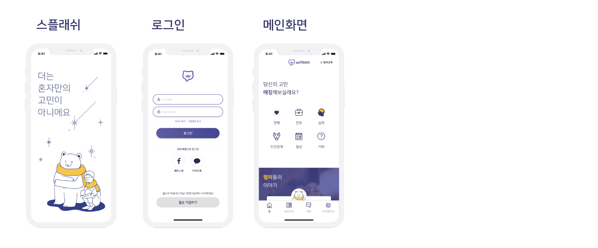
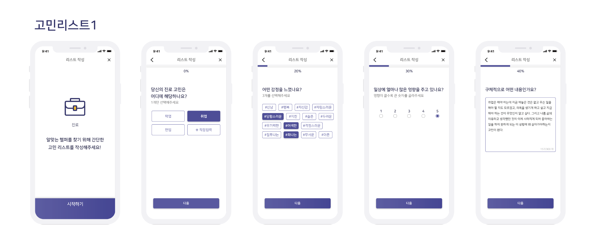
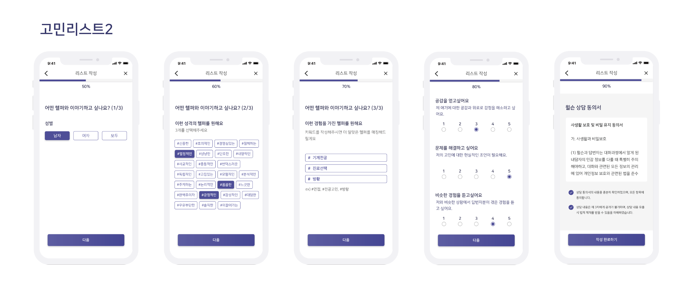
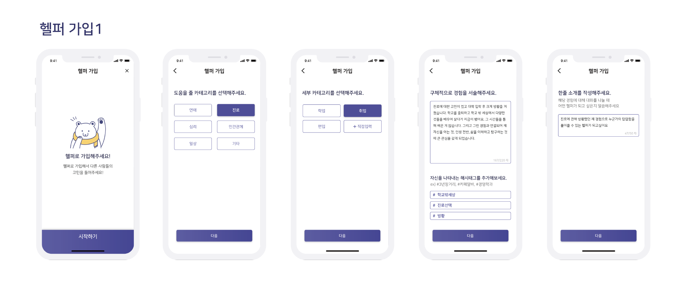
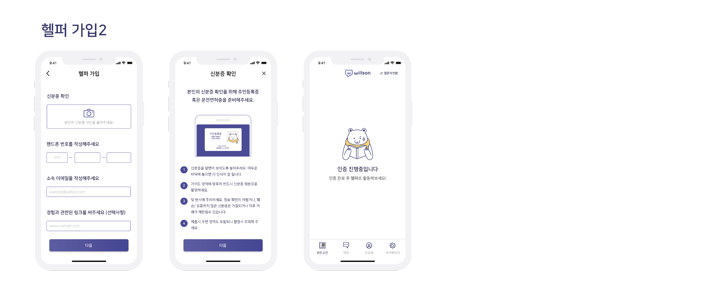
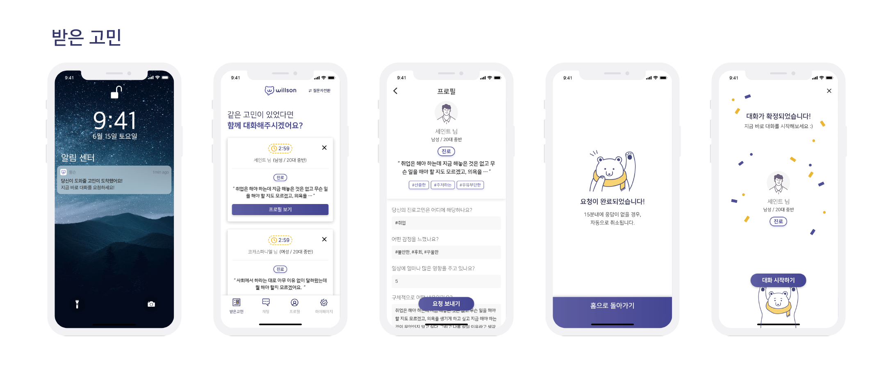
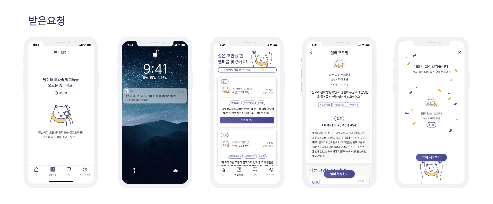
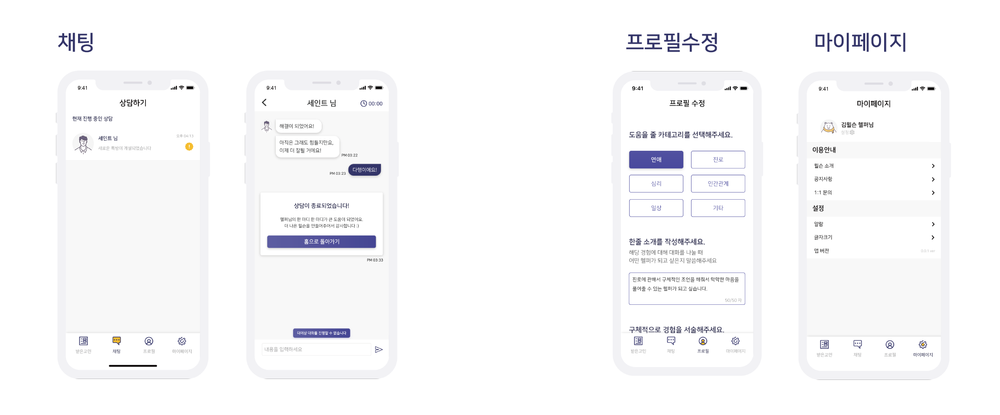

# Willson🐻

## 1. Willson🐻, 1:1 온라인 고민 상담 매칭 플랫폼

### 윌슨🐻은 20대 대학생·청년들을 위한 맞춤 매칭 1:1 고민상담 온라인 플랫폼입니다.

`윌슨`은 익명의 1:1 고민대화 서비스로 고민을 하는 `고민자`가 ‘그 고민’을 해본 `헬퍼`와 고민에 대해 상담하는 플랫폼입니다. 핵심기능으로는 질문자와 답변자를 연결하는 `매칭 시스템`과 고민을 나눌 수 있는 `채팅` 기능, 양질의 답변자를 유입시키고 유지할 수 있는 관리 시스템으로 구성되어 있습니다.

### 맞춤 매칭이란?
### `고민자`의 고민을 해본 경험이 있는 `헬퍼`를 매칭시켜 주는 것을 의미합니다. 

실제로 `한국심리학회`에서는 `기존 상담의 한계`는 `상담사`가 내담자의 고민을 경험해본 적이 없어 `공감을 하기 어렵다는 점`이라고 합니다. 역할수용(역지사지)의 능력이 매우 중요하다는 것을 알 수 있습니다. 

대학내일연구소에 의하면 20대는 1인 월 평균 고민은 3.9로 나타났으며, `실제로 고민을 마땅히 말할 곳이 없어` 답답해하는 현상이 생긴다고 합니다. (동아일보) 

최근 `2030세대의 스트레스 민감도가 가장 높으며`, 20대 정신관련 내원자가 5년간 37% /증가했습니다.

20대 대학생들은 전문가보다 **본인의 고민을 해본 경험이 있는 사람을 원합니다.** 이런 헬퍼와 대화하며 `진심 어린 공감`과 `해당 고민에 대한 상대의 경험`을 듣고자 합니다. 

### `윌슨🐻`과 고민상담으로 스트레스를 해소해보는건 어떨까요~? ☺️

## 2. 서비스 워크플로우 👀

### 1.`고민자` 모드
### 2. `헬퍼` 모드
### 두개의 모드가 존재합니다.
default는 `고민자`입니다.

### 상담 플로우는 다음과 같습니다.

1. `고민자` 고민 등록
2. `헬퍼` 고민에 요청 보내기
3. `고민자` 수락한 헬퍼 중 헬퍼 결정하기
4. `고민자` 와 `헬퍼`의 대화 시작
5. 1:1 상담 시작 (60분 제한)

- ### `고민자` 로그인 -> 메인화면

`고민자`로 로그인 후 메인화면에서 `카테고리` 를 선택하여 **고민 리스트** 작성 화면으로 넘어갑니다.

- ### `고민자`: 고민리스트를 작성합니다.

### 고민이 있어 헬퍼와 상담하고 싶다면 고민 리스트를 작성해야 합니다.

- 고민 카테고리
- 상세 카테고리
- 느낀 감정 (최대 3개)
- 일상 영향 정도 선택 (최소 1, 최대 5)
- 구체적인 내용 서술
- 헬퍼 선택 1: 성별 
- 헬퍼 선택 2: 성격
- 헬퍼 선택 3: 경험
- 공감, 문제 해결, 경험 중요도 선택 (최소 1, 최대 5)
- 윌슨 상담 동의서 작성

### 다음과 같은 순서로 리스트를 작성 후 작성 완료 버튼을 누릅니다.  

### 작성 완료 하면 비슷한 경험을 가진 헬퍼에게 고민이 전송됩니다. 😉

### `헬퍼` 역할을 하기 위해서는 메인에서 `헬퍼 전환` 버튼을 누르면 됩니다.

- ### `헬퍼`: 가입

### 유저가 이전에 헬퍼 가입을 한 적이 없다면, 헬퍼 가입을 해야합니다.

- 도움을 줄 카테고리
- 세부 카테고리
- 구체적 경험
- 자신을 나타내는 해시태그
- 한줄 소개
- 신분증 확인 (임시)
- 핸드폰 번호, 이메일, 링크 입력

### 위와 같은 정보를 입력하면 관리자에 의해 인증을 진행 후 헬퍼가 될 수 있습니다. 😎

- ### `헬퍼`: 받은고민

헬퍼 가입이 완료되면 받은 고민을 확인할 수 있습니다.

### 상담을 원한다면 `요청 보내기` 버튼을 누릅니다.

보낸 요청을 `고민자` 가 수락한다면 대화 확정이 됩니다.

- ### `고민자`: 받은요청

`고민자` 의 고민을 수락한 `헬퍼` 가 있다면 `고민자` 의 받은요청 탭에서 확인할 수 있습니다.

### `헬퍼` 의 프로필 확인 후 `헬퍼 결정하기` 버튼을 눌러 대화를 시작할 수 있습니다. 😎

- ### `고민자`: 채팅, 마이페이지

- 1:1 온라인 상담 진행 후 `후기` 를 입력할 수 있습니다. 
- 마이페이지에서 고민자 자신의 정보를 확인할 수 있습니다.

- ### `헬퍼` :  채팅, 프로필 수정, 마이페이지

-  1:1 온라인 상담이 끝나면 홈으로 돌아가게 됩니다.
- 들어줄 고민에 대한 프로필을 수정할 수 있습니다.
- 마이페이지에서 헬퍼 자신의 정보를 확인할 수 있습니다.

